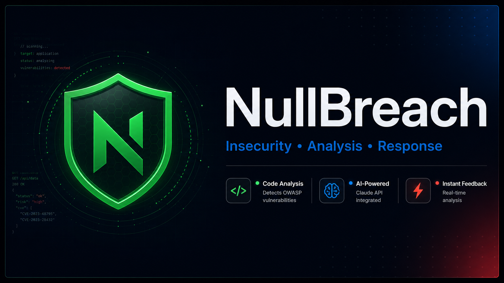

<h1 align="left">
  
  NullBreach • UI
</h1>



> NullBreach is a production-grade React interface for AI-powered security analysis. Chat with Claude about cybersecurity, submit code for instant OWASP vulnerability detection, and manage your session history, all behind JWT authentication. Deploys to Netlify in one click.

[](https://wavival.dev/nullbreach)
[](https://nullbreach-api.wavival.dev/api/docs/)
[](https://github.com/wavival/nullbreach-api)

## Table of contents

- [Stack](#stack)
- [Local setup](#local-setup)
  - [npm scripts](#npm-scripts)
- [Environment variables](#environment-variables)
- [Architecture](#architecture)
  - [Auth flow](#auth-flow)
  - [Bundle splitting](#bundle-splitting)
- [Testing](#testing)
- [Deploying to Netlify](#deploying-to-netlify)
  - [One-time setup](#one-time-setup)
  - [What's already in the repo](#whats-already-in-the-repo)
  - [CSP](#csp)
  - [Backend CORS](#backend-cors)
- [Troubleshooting](#troubleshooting)
- [Roadmap / known gaps](#roadmap--known-gaps)
- [License](#license)

Related docs: [DESIGN.md](./DESIGN.md) · [COMPONENTS.md](./COMPONENTS.md) · [CONTRIBUTING.md](./CONTRIBUTING.md)

## Stack

| Layer       | Choice                                                    |
| ----------- | --------------------------------------------------------- |
| Build       | Vite 5, TypeScript 5 (strict)                             |
| UI          | React 18, React Router 6, Tailwind 3, Radix Slot          |
| Forms       | react-hook-form + zod                                     |
| HTTP        | axios (interceptor-based JWT refresh)                     |
| Markdown    | react-markdown + remark-gfm                               |
| Toasts      | react-hot-toast                                           |
| Tests       | Vitest + Testing Library + MSW                            |
| CI          | GitHub Actions: lint → typecheck → test → build           |
| Hosting     | Netlify (SPA fallback + immutable asset cache + CSP)      |

## Local setup

```bash
git clone git@github.com:wavival/nullbreach-web.git
cd nullbreach-web
npm install
cp .env.example .env.local       # adjust VITE_API_URL if backend lives elsewhere
npm run dev                      # http://localhost:5173/nullbreach/
```

`vite.config.ts` pins `base: "/nullbreach/"` so dev and prod both serve the SPA under the `/nullbreach/` subpath (matches `wavival.dev/nullbreach`).

Backend must be running and CORS-permissive to the dev origin.

### npm scripts

| Script                  | What it does                                        |
| ----------------------- | --------------------------------------------------- |
| `npm run dev`           | Vite dev server with HMR                            |
| `npm run build`         | `tsc -b && vite build` → `dist/`                    |
| `npm run preview`       | Serve the production build locally                  |
| `npm run lint`          | ESLint 9 (flat config), zero warnings target        |
| `npm run typecheck`     | `tsc -b` across `app` + `node` projects             |
| `npm test`              | Vitest one-shot run                                 |
| `npm run test:watch`    | Vitest watch mode                                   |
| `npm run test:coverage` | Vitest + v8 coverage (`coverage/`)                  |

## Environment variables

All client-exposed vars must be `VITE_`-prefixed (Vite-enforced). Production builds **fail fast** when `VITE_API_URL` is unset; only dev falls back to `http://localhost:8000`.

Backend is mounted at the **root** of `VITE_API_URL` (no `/api` prefix). The axios client appends paths like `/auth/login/`, `/auth/refresh/`, `/chat/sessions/` directly to the base.

| Variable             | Required | Example                                       | Notes                                            |
| -------------------- | -------- | --------------------------------------------- | ------------------------------------------------ |
| `VITE_API_URL`       | Yes      | `https://nullbreach-api.wavival.dev`          | Base URL; the app appends `/auth/login/` etc.    |
| `VITE_WHATSAPP_URL`  | No       | `https://wa.me/...`                           | Floating contact button. Default baked in.       |
| `VITE_AUTHOR_NAME`   | No       | `Valentina Ramírez`                           | Footer attribution.                              |
| `VITE_AUTHOR_URL`    | No       | `https://wavival.dev`                         | Footer link.                                     |

Copy `.env.example` to `.env.local` for local overrides. `.env.production` ships the prod URL for explicit `vite build` runs outside Netlify.

## Architecture

```
src/
├── App.tsx                  React.lazy routes + Suspense
├── main.tsx                 BrowserRouter (v7 future flags) + ErrorBoundary
├── components/
│   ├── ErrorBoundary.tsx    class component, dev-only stack trace
│   ├── layout/              Layout / Navbar / Sidebar / Footer / ProtectedRoute
│   └── ui/                  Button, Badge, Card, Input, Toast viewport, InlineError, Markdown, WhatsAppButton
├── context/
│   ├── auth-context.ts      bare createContext()
│   └── AuthContext.tsx      AuthProvider (login/register/logout/setUser)
├── hooks/                   useAuth, useError, useMediaQuery, useFocusTrap, usePageTitle
├── lib/                     errors, toast, date, image (canvas avatar downscale), utils
├── pages/                   Login, Home, Chat, Analyzer, NotFound
├── services/
│   ├── api.ts               axios instance + 401 refresh-once interceptor
│   └── tokenStore.ts        sessionStorage-backed observable store
├── types/                   auth, chat, api, index
└── test/                    setup, MSW server + handlers, ambient vitest types
```

### Auth flow

1. `POST /auth/login/` returns `{ access, refresh, user }`.
2. Tokens written to `sessionStorage` via `tokenStore`. Axios request interceptor injects `Authorization: Bearer`.
3. On `401`, response interceptor calls `POST /auth/refresh/` **once** (deduped via in-flight promise), retries the original request.
4. Refresh failure → `tokenStore.clear()` → `AuthProvider` subscriber wipes user → `ProtectedRoute` redirects to `/login`.

JWTs in `sessionStorage` are vulnerable to XSS — the Netlify CSP in `netlify.toml` is the primary mitigation. For higher-assurance setups, switch to httpOnly cookies on the backend and remove the bearer plumbing.

### Bundle splitting

`vite.config.ts` declares `manualChunks` for `react-vendor`, `forms`, `markdown`, `http`, `icons`. Each route is `React.lazy`-loaded. Result: first-paint of `/` skips the markdown + forms chunks entirely.

## Testing

Vitest + jsdom + Testing Library + MSW. Tests live next to source as `*.test.ts(x)`.

```bash
npm test                  # 33 tests across 6 files (~5s)
npm run test:coverage     # writes coverage/ HTML report
```

MSW intercepts `axios` at the network layer — `src/test/handlers.ts` is the default fixture, individual suites override via `server.use(...)`.

## Deploying to Netlify

### One-time setup

1. **Create site**: Netlify dashboard → *Add new site* → *Import from Git* → select repo.
2. **Build settings** (auto-detected from `netlify.toml`):
   - Build command: `npm run build`
   - Publish directory: `dist`
   - Node version: `20` (pinned in `netlify.toml`)
3. **Environment variables** → set in *Site settings → Environment variables*:
   - `VITE_API_URL = https://nullbreach-api.wavival.dev`
   - (optional) `VITE_WHATSAPP_URL`, `VITE_AUTHOR_NAME`, `VITE_AUTHOR_URL`
4. **Custom domain**: *Domain settings* → add domain → follow CNAME instructions. SSL auto-provisions via Let's Encrypt.
5. **Deploy**: push to `main`. GitHub Actions runs the CI pipeline; on green, Netlify auto-builds and publishes.

### What's already in the repo

- `netlify.toml` — build config, SPA redirect, immutable asset caching, security headers, CSP.
- `public/_redirects` — belt-and-suspenders SPA fallback.
- `public/robots.txt`, `public/sitemap.xml`, `public/manifest.webmanifest`.
- `.github/workflows/ci.yml` — lint, typecheck, test, build gates the PR before Netlify deploys.

### CSP

`netlify.toml` sets a strict `Content-Security-Policy`. `connect-src` whitelists `https://nullbreach-api.wavival.dev`. Update that line if the API origin changes or you add 3rd-party endpoints (Sentry, PostHog, etc.).

### Backend CORS

Django backend must allow the Netlify origin:

```python
# settings.py
CORS_ALLOWED_ORIGINS = [
    "https://wavival.dev",
    # plus any Netlify preview / staging origins
]
CORS_ALLOW_CREDENTIALS = False  # we use bearer tokens, not cookies
```

## Troubleshooting

| Symptom                                          | Fix                                                                                                        |
| ------------------------------------------------ | ---------------------------------------------------------------------------------------------------------- |
| Build error: `VITE_API_URL is required`          | Set the env var in Netlify dashboard (or `.env.production` for local builds).                              |
| Login redirect loop                              | Backend not returning a valid `access` token, or CORS blocking the response. Check Network tab.            |
| 404 on direct deep-link (`/chat/123`)            | SPA fallback missing — verify `netlify.toml` or `public/_redirects` is published.                          |
| Fonts flash unstyled                             | `preconnect` to `fonts.gstatic.com` is in `index.html`; if persistent, switch to self-hosted fonts.        |
| Toast notifications stacked off-screen           | `<ToastViewport />` mounts in `App.tsx`; ensure it's not unmounted by a route guard.                       |

## Roadmap / known gaps

- No `AbortController` cancellation on unmounted fetches.
- Observability hook in `ErrorBoundary` is a stub; wire Sentry or alternative.
- Markdown contrast not WCAG-audited against the dark theme.
- `index.css` pulls Inter + JetBrains Mono from Google Fonts; self-hosting would remove the third-party connect / FOUT risk.

## License

This project is licensed under the **MIT License**, with the following clarification:

- **Clone**: You can clone this repository freely
- **Fork**: You can fork and create your own version
- **Contribute**: Pull requests and contributions are welcome
- **Learn**: Use this code to study and learn software architecture
- **Modify**: Adapt the code to your needs
- **Attribution**: Please credit the original author (Valentina Ramírez / @wavival)

This is **not** a commercial product. It's an educational resource demonstrating 
backend security, API design, and full-stack development practices. See the [LICENSE](./LICENSE) file for the full text.

Copyright © 2026 Valentina Ramírez.

## Contact


<h3 align="left">
  
  Valentina Ramírez • @wavival
</h3>

> Thanks for getting here. Let's build great things.

[](https://www.linkedin.com/in/wavival)
[](https://www.instagram.com/wavival)
[](mailto:wavival.dev@luminaw.co)
